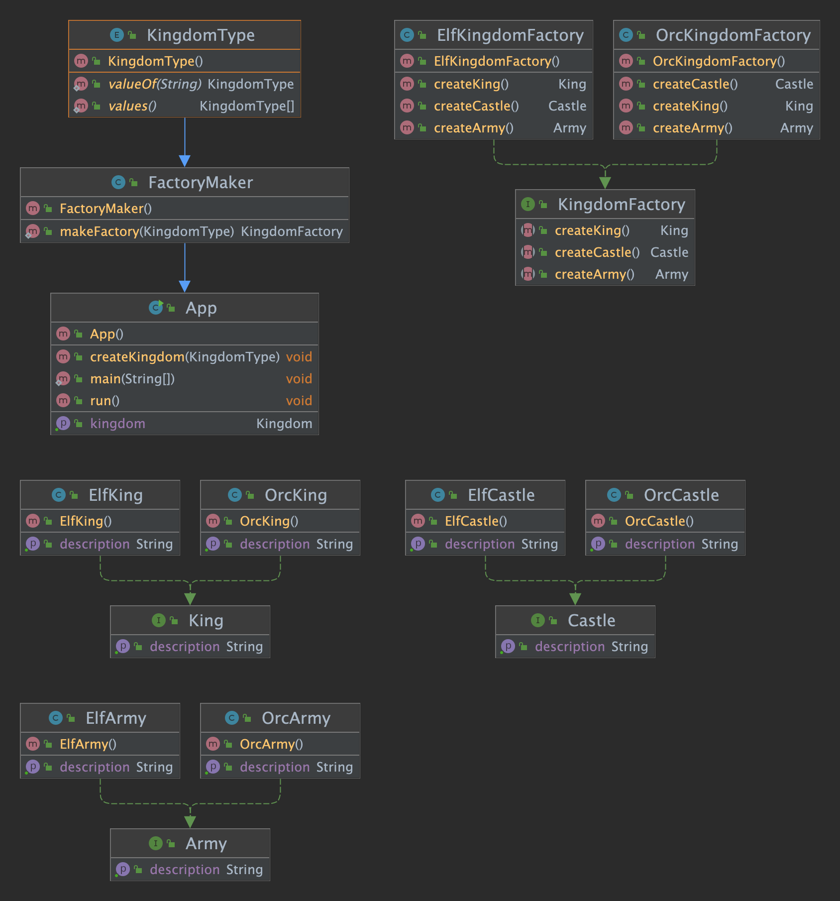

# Abstract Factory

## 의도

---

구체적인 클래스를 지정하지 않고 관련 객체 또는 종속 객체의 패밀리를 작성할 수 있는 인터페이스를 제공하기 위함

## 설명

---

Real-world example

> To create a kingdom we need objects with a common theme. The elven kingdom needs an elven king, elven castle, and elven army whereas the orcish kingdom needs an orcish king, orcish castle, and orcish army. There is a dependency between the objects in the kingdom.

In plain words

> A factory of factories; a factory that groups the individual but related/dependent factories together without specifying their concrete classes.

Wikipedia says

> The abstract factory pattern provides a way to encapsulate a group of individual factories that have a common theme without specifying their concrete classes

## 코드 설명

---

코드를 활용해 왕국을 만들어보겠습니다.
먼저, 왕국에 필요한 요소들에 대한 interface와 implemation을 만들어보겠습니다.

```java
public interface Castle {
  String getDescription();
}

public interface King {
  String getDescription();
}

public interface Army {
  String getDescription();
}

// Elven implementations ->
public class ElfCastle implements Castle {
  static final String DESCRIPTION = "This is the elven castle!";
  @Override
  public String getDescription() {
    return DESCRIPTION;
  }
}
public class ElfKing implements King {
  static final String DESCRIPTION = "This is the elven king!";
  @Override
  public String getDescription() {
    return DESCRIPTION;
  }
}
public class ElfArmy implements Army {
  static final String DESCRIPTION = "This is the elven Army!";
  @Override
  public String getDescription() {
    return DESCRIPTION;
  }
}

```

kingdom factory에 관련한 abstraction와 implementations를 구현해보겠습니다.

```java
public interface KingdomFactory {
  Castle createCastle();
  King createKing();
  Army createArmy();
}

public class ElfKingdomFactory implements KingdomFactory {

  @Override
  public Castle createCastle() {
    return new ElfCastle();
  }

  @Override
  public King createKing() {
    return new ElfKing();
  }

  @Override
  public Army createArmy() {
    return new ElfArmy();
  }
}

public class OrcKingdomFactory implements KingdomFactory {

  @Override
  public Castle createCastle() {
    return new OrcCastle();
  }

  @Override
  public King createKing() {
    return new OrcKing();
  }

  @Override
  public Army createArmy() {
    return new OrcArmy();
  }
}
```

지금까지 작성한 코드를 통해 Objectc들 간의 관계를 가지고 있는지 확인해보겠습니다.

```java
var factory = new ElfKingdomFactory();
var castle = factory.createCastle();
var king = factory.createKing();
var army = factory.createArmy();

castle.getDescription();
king.getDescription();
army.getDescription();
```

다음과 같은 결과를 얻을 수 있습니다.

```
This is the elven castle!
This is the elven king!
This is the elven Army!
```

이제, 다양한 왕국 공장들을 위한 공장을 설계할 수 있도록 Factorymaker를 만들겠습니다. 클라이언트는 Factorymaker를 통해 원하는 왕국 공장들을 만들 수 있습니다.

```java
@Getter
@Setter
public class Kingdom {
    private King king;
    private Castle castle;
    private Army army;
}


public class FactoryMaker {
    public static KingdomFactory makeFactory(KingdomType type) {
        switch (type) {
            case ELF:
                return new ElfKingdomFactory();
            case ORC:
                return new OrcKingdomFactory();
            default:
                throw new IllegalArgumentException("KingdomType not supported.");
        }
    }
}

public class App implements Runnable{
    private static final Logger LOGGER = LogManager.getLogger();

    private final Kingdom kingdom = new Kingdom();

    public Kingdom getKingdom(){
        return this.kingdom;
    }

    public static void main(String[] args) {
        var app = new App();
        app.run();
    }

    @Override
    public void run() {
        LOGGER.info("elf kingdom");
        createKingdom(KingdomType.ELF);
        LOGGER.info(kingdom.getArmy().getDescription());
        LOGGER.info(kingdom.getCastle().getDescription());
        LOGGER.info(kingdom.getKing().getDescription());

        LOGGER.info("orc kingdom");
        createKingdom(KingdomType.ORC);
        LOGGER.info(kingdom.getArmy().getDescription());
        LOGGER.info(kingdom.getCastle().getDescription());
        LOGGER.info(kingdom.getKing().getDescription());
    }

    /**
     * Creates kingdom.
     * @param kingdomType type of Kingdom
     */
    public void createKingdom(KingdomType kingdomType) {
        final KingdomFactory kingdomFactory = FactoryMaker.makeFactory(kingdomType);
        kingdom.setKing(kingdomFactory.createKing());
        kingdom.setCastle(kingdomFactory.createCastle());
        kingdom.setArmy(kingdomFactory.createArmy());
    }
}
```

## Class Diagram

---



## Applicability

---

Abstracy Factory pattern은 다음과 같을 때 적용하면 좋습니다.

- 시스템이 제품 생성, 구성 및 표현되는 방식과 독립적이어야 할 때
- 시스템이 여러 제품군 중 하나로 구성되어야 할 때
- 관련 제품 개체 패밀리는 함께 사용하도록 설계되었으며 이 제약 조건을 적용해야 하는 경우
- 동급 제품 라이브러리를 제공하고 구현이 아닌 인터페이스만 공개하려고할 경우
- 의존성의 수명은 개념적으로 소비자의 수명보다 짧은 경우
- 특정 종속성을 구성할 때 런타임 값이 필요할 경우
- 런타임에 패밀리로부터 호출할 제품을 결정할 때
- 종속성을 해결하려면 런타임에만 알려진 매개 변수를 하나 이상 제공해야 할 때
- 제품 간의 일관성이 필요할 때.
- 프로그램에 새 제품 또는 제품군을 추가할 때 기존 코드를 변경하지 않는 것이 필요한 경우

실제 사용케이스

- 런타임에 FileSystemAcmeService, DatabaseAcmeService 또는 NetworkAcmeService의 적절한 구현을 호출하도록 선택
- 유닛 테스트 케이스를 쉽게 작성 할 때
- 각각 다른 OS의 UI 툴

## Consequences

---

- java의 종속성 주입은 컴파일 시 잡혔을 런타임 오류를 유발할 수 있는 서비스 클래스 종속성을 숨겨줍니다.
- 미리 정의된 개체를 생성할 때 해당 패턴을 사용하면 좋지만 새 개체를 추가하는 것은 어려울 수 있습니다.
- 패턴과 함께 새로운 인터페이스와 클래스를 많이 사용하기 때문에 코드가 복잡해집니다.
