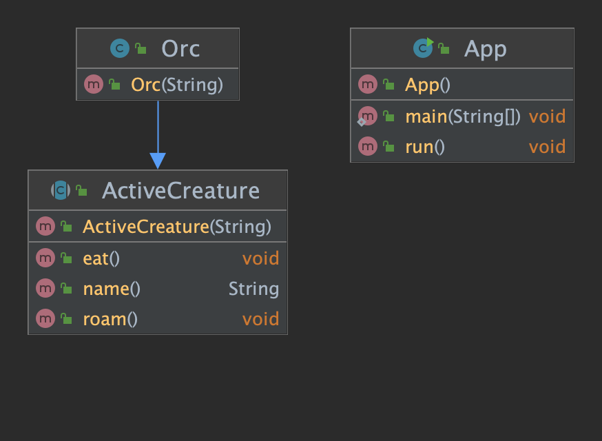

# active-object

## 의도

---

각각 제어 스레드에 있는 객체에 대한 메서드 실행에서 메소드를 분리합니다. 목표는 비동기 메서드 호출과 요청을 처리하기 위한 스케줄러를 사용하여 동시성을 도입하기 위함

## 설명

---

Active object pattern을 구현하는 클래스에는 '동기화' 방법을 사용하지 않고 자체 동기화 메커니즘이 포함됩니다.

Real-world example

> The Orcs are known for their wildness and untameable soul. It seems like they have their own thread of control based on previous behavior.

자체 제어 매커니즘을 가지고 있는객체를 구현하고 실행 자체가 아닌 API만을 노출하기 위해 Active object pattern을 사용할 수 있습니다.

## 코드 설명

---

```java
public abstract class ActiveCreature {

    private static final Logger logger = LogManager.getLogger();

    private BlockingQueue<Runnable> requests;

    private String name;

    private Thread thread;

    public ActiveCreature(String name) {
        this.name = name;
        this.requests = new LinkedBlockingQueue<Runnable>();
        thread = new Thread(new Runnable() {
            @Override
            public void run() {
                while (true) {
                    try{
                       requests.take().run();
                    } catch (Exception e){
                        logger.error(e.getMessage());
                    }
                }
            }
        });
        thread.start();
    }


    public void eat() throws InterruptedException {
        requests.put(() -> {
            logger.info("{} is eating!",name());
            logger.info("{} has finished eating!",name());
        });
    }

    public void roam() throws InterruptedException {
        requests.put(new Runnable() {
                         @Override
                         public void run() {
                             logger.info("{} has started to roam the wastelands.",name());
                         }
                     }
        );
    }

    public String name() {
        return this.name;
    }
}

```

ActiveCreator 클래스를 상속받은 클래스는 메서드를 호출하고 실행하기 위한 자체 제어 스레드를 가질 수 있습니다.

```java
public class Orc extends ActiveCreature {

  public Orc(String name) {
    super(name);
  }

}
```

이제, Orcs와 같은 다양한 객체들을 여러개 생성할 수 있습니다.
그 객체들은 자신의 쓰레드를 실행시켜서 자신들만의 함수를 사용합니다.

```java
public class App implements Runnable{

    private static final Logger logger = LogManager.getLogger();
    private static final int NUM_CREATURES = 100;

    public static void main(String[] args) {
        var app = new App();
        app.run();
    }

    @Override
    public void run() {
        List<ActiveCreature> creatures = new ArrayList<>();
        try {
            for (int i = 0;i < NUM_CREATURES;i++) {
                creatures.add(new Orc(Orc.class.getSimpleName() + i));
                creatures.get(i).eat();
                creatures.get(i).roam();
            }
            Thread.sleep(1000);
        } catch (InterruptedException e) {
            logger.error(e.getMessage());
        }
        Runtime.getRuntime().exit(1);
    }
}
```

## Class Diagram

---



## 코드 링크

---


