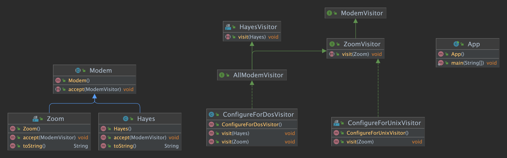

# Acyclic Visitor

## 의도

---

GoF 방문자 패턴에 내재된 성가신 종속성 사이클을 만들지 않고 해당 계층에 영향을 미치지 않고 새 기능을 기존 클래스 계층에 추가하고자 할 때

## 설명

---

Real-world example

> We have a hierarchy of modem classes. The modems in this hierarchy need to be visited by an external algorithm based on filtering criteria (is it Unix or DOS compatible modem).

In plain words

> Acyclic Visitor allows functions to be added to existing class hierarchies without modifying the hierarchies.

Wikipedia says

> The Acyclic Visitor pattern allows new functions to be added to existing class hierarchies without affecting those hierarchies, and without creating the dependency cycles that are inherent to the GangOfFour VisitorPattern.

## 코드 설명

---

먼저 Modem 계층을 만들겠습니다.

```java
public abstract class Modem {
    public abstract void accept(ModemVisitor modemVisitor);
}

public class Hayes extends Modem{

    private final Logger logger = LogManager.getLogger();

    @Override
    public void accept(ModemVisitor modemVisitor) {
        if (modemVisitor instanceof HayesVisitor) {
            ((HayesVisitor)modemVisitor).visit(this);
        }else{
            logger.info("Only HayesVisitor is allowed to visit Hayes modem");
        }
    }

    @Override
    public String toString() {
        return "Hayes Modem";
    }
}

public class Zoom extends Modem {
    private final Logger logger = LogManager.getLogger();
    @Override
    public void accept(ModemVisitor modemVisitor) {
        if (modemVisitor instanceof ZoomVisitor) {
            ((ZoomVisitor) modemVisitor).visit(this);
        }else{
            logger.info("Only ZoomVisitor is allowed to visit Zoom modem");
        }
    }

    @Override
    public String toString() {
        return "Zoom Modem";
    }
}
```

다음으로 ModemVisitor 계층을 만들어보겠습니다.

```java
public interface ModemVisitor {
}
public interface HayesVisitor extends ModemVisitor{
    void visit(Hayes hayes);
}
public interface ZoomVisitor extends ModemVisitor{
    void visit(Zoom zoom);
}

public interface AllModemVisitor extends ZoomVisitor, HayesVisitor {
}

public class ConfigureForDosVisitor implements AllModemVisitor {

    private final Logger logger = LogManager.getLogger();

    @Override
    public void visit(Hayes hayes) {
        logger.info(hayes + " used with Dos configurator.");
    }

    @Override
    public void visit(Zoom zoom) {
        logger.info(zoom + " used with Dos configurator.");
    }
}

public class ConfigureForUnixVisitor implements ZoomVisitor {

    private final Logger logger = LogManager.getLogger();

    @Override
    public void visit(Zoom zoom) {
        logger.info(zoom + " used with Unix configurator.");
    }
}
```

마지막으로 이를 동작 시켜보도록하겠습니다.

```java
public class App {
    public static void main(String[] args) {
        var conUnix = new ConfigureForUnixVisitor();
        var conDos = new ConfigureForDosVisitor();
        var zoom = new Zoom();
        var hayes = new Hayes();
        hayes.accept(conDos);
        zoom.accept(conDos);
        hayes.accept(conUnix);
        zoom.accept(conUnix);
    }
}
```

## Class Diagram

---



## Applicability

---

Acyclic Visitor pattern은 다음과 같을 때 적용하면 좋습니다.

- 계층을 변경하거나 영향을 주지 않고 기존 계층에 새 기능을 추가해야 하는 경우
- ConfigureForDOS / ConfigureForUnix / ConfigureForX 문제와 같이 계층 자체에 속하지 않는 기능이 있는 경우
- 개체에 대해 유형에 따라 매우 다른 작업을 수행해야 하는 경우
- 방문한 클래스 계층 구조가 요소 클래스의 새 파생 모델로 자주 확장되는 경우
- 요소의 도함수를 재컴파일, 재링크, 재테스트 또는 재배포하는 비용이 매우 많이 드는 경우

## Consequences

---

장점

- 클래스 계층 사이에 사이클이 사라진다
- 새로운 하나가 추가되더라도 모든 Visitor를 recompile 할 필요가 없다.
- 클래스 계층에 새 멤버가 있는 경우 기존 방문자에게 컴파일 오류가 발생하지 않습니다.

단점

- 모든 방문객을 수용할 수 있지만 실제로는 특정 방문객에게만 관심이 있다는 것을 보여줌으로써 리스코프의 치환 원칙을 위반합니다.
- 방문 가능한 클래스 계층의 모든 구성원에 대해 방문자의 병렬 계층이 생성되어야 합니다.

## 코드 링크

---


