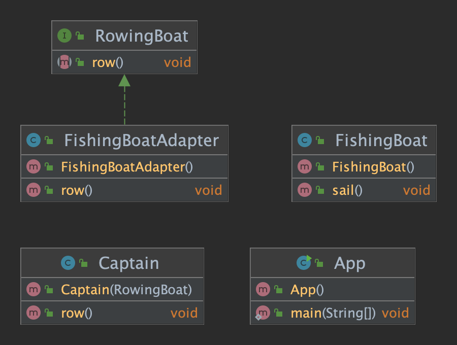

# adapter

## 의도

---

클래스의 인터페이스를 클라이언트가 기대하는 다른 인터페이스로 변환합니다. 호환되지 않는 인터페이스로 인해 클래스가 함께 작동할 수 있습니다.

## 설명

---

Real-world example

> Consider that you have some pictures on your memory card and you need to transfer them to your computer. To transfer them, you need some kind of adapter that is compatible with your computer ports so that you can attach a memory card to your computer. In this case card reader is an adapter. Another example would be the famous power adapter; a three-legged plug can't be connected to a two-pronged outlet, it needs to use a power adapter that makes it compatible with the two-pronged outlets. Yet another example would be a translator translating words spoken by one person to another

In plain words

> Adapter pattern lets you wrap an otherwise incompatible object in an adapter to make it compatible with another class.

Wikipedia says

> In software engineering, the adapter pattern is a software design pattern that allows the interface of an existing class to be used as another interface. It is often used to make existing classes work with others without modifying their source code.

## 코드 설명

---

노 젓는 배만 이용할 수 있고 항해를 전혀 할 수 없는 선장을 생각해 보겠습니다.

먼저, Rowing Boat와 Fishing Boat를 만들어 보겠습니다.

```java

public interface RowingBoat {
    void row();
}

public class FishingBoat {

    private final Logger logger = LogManager.getLogger();

    public void sail(){
        logger.info("The fishing boat is sailing");
    }
}

```

And captain expects an implementation of RowingBoat interface to be able to move

```java
public class Captain {
    private final RowingBoat rowingBoat;

    public Captain(RowingBoat rowingBoat) {
        this.rowingBoat = rowingBoat;
    }

    public void row(){
        this.rowingBoat.row();
    }
}

```

Now let's say the pirates are coming and our captain needs to escape but there is only a fishing boat available. We need to create an adapter that allows the captain to operate the fishing boat with his rowing boat skills.

```java
public class FishingBoatAdapter implements  RowingBoat{

    private FishingBoat fishingBoat;

    public FishingBoatAdapter() {
        fishingBoat = new FishingBoat();
    }

    @Override
    public void row() {
        fishingBoat.sail();
    }
}
```

And now the Captain can use the FishingBoat to escape the pirates.

```java
var captain = new Captain(new FishingBoatAdapter());
captain.row();
```

## Class Diagram

---



## Applicability

---

Adapter pattern은 다음과 같을 때 적용하면 좋습니다.

- You want to use an existing class, and its interface does not match the one you need
- You want to create a reusable class that cooperates with unrelated or unforeseen classes, that is, classes that don't necessarily have compatible interfaces
- You need to use several existing subclasses, but it's impractical to adapt their interface by subclassing everyone. An object adapter can adapt the interface of its parent class.
- Most of the applications using third-party libraries use adapters as a middle layer between the application and the 3rd party library to decouple the application from the library. If another library has to be used only an adapter for the new library is required without having to change the application code.

## Consequences

---

Class and object adapters have different trade-offs. A class adapter

- Adapts Adaptee to Target by committing to a concrete Adaptee class. As a consequence, a class adapter won’t work when we want to adapt a class and all its subclasses.
- Let’s Adapter override some of Adaptee’s behavior since Adapter is a subclass of Adaptee.
- Introduces only one object, and no additional pointer indirection is needed to get to the adaptee.
  An object adapter

- Lets a single Adapter work with many Adaptees—that is, the Adaptee itself and all of its subclasses (if any). - The Adapter can also add functionality to all Adaptees at once.
- Makes it harder to override Adaptee behavior. It will require subclassing Adaptee and making the Adapter refer to the subclass rather than the Adaptee itself.

## 코드 링크

---


