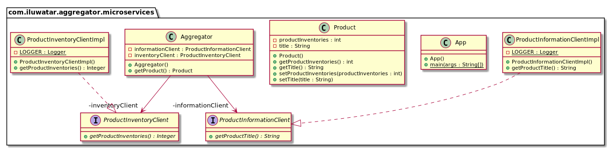

# Aggregator Microservices

## 의도

---

사용자가 Aggregator 서비스에 한 번 호출하면 Aggregator가 각 관련 마이크로 서비스를 호출합니다.

## 설명

---

Real-world example

> Our web marketplace needs information about products and their current inventory. It makes a call to an aggregator service which in turn calls the product information microservice and product inventory microservice returning the combined information.

In plain words

> Aggregator Microservice collects pieces of data from various microservices and returns an aggregate for processing.

Wikipedia says

> Aggregator Microservice invokes multiple services to achieve the functionality required by the application.

## 코드 설명

---

먼저 Aggregator 서비스에서 Product 클래스를 생성 및 서비스를 구현하겠습니다.

```java
@Getter
@Setter
public class Product {
    private String title;
    private int productInventories;
}
public interface ProductInformationClient {
    String getProductTitle();
}
public interface ProductInventoryClient {
    Integer getProductInventories();
}
@Component
public class ProductInformationClientImpl implements ProductInformationClient{

    private Logger LOGGER = LogManager.getLogger();
    @Override
    public String getProductTitle() {
        var request = HttpRequest.newBuilder()
                .GET()
                .uri(URI.create("http://localhost:5006/information"))
                .build();
        var client = HttpClient.newHttpClient();
        try {
            var httpResponse = client.send(request, HttpResponse.BodyHandlers.ofString());
            return httpResponse.body();
        } catch (IOException ioe) {
            LOGGER.error("IOException Occurred", ioe);
        } catch (InterruptedException ie) {
            LOGGER.error("InterruptedException Occurred", ie);
            Thread.currentThread().interrupt();
        }
        return null;
    }
}

@Component
public class ProductInventoryClientImpl implements ProductInventoryClient {

    private Logger LOGGER = LogManager.getLogger();

    @Override
    public Integer getProductInventories() {
        var response = "";
        var request = HttpRequest.
                newBuilder().
                GET().
                uri(URI.create("http://localhost:5005/inventories"))
                .build();
        var client = HttpClient.newHttpClient();
        try {
            var httpResponse = client.send(request, HttpResponse.BodyHandlers.ofString());
            response = httpResponse.body();
        } catch (IOException ioe) {
            LOGGER.error("IOException Occurred", ioe);
        } catch (InterruptedException ie) {
            LOGGER.error("InterruptedException Occurred", ie);
            Thread.currentThread().interrupt();
        }
        if ("".equalsIgnoreCase(response)) {
            return null;
        } else {
            return Integer.parseInt(response);
        }
    }
}
```

다음으로 Inventory microservice와 Information microservice를 간단하게 작성해보겠습니다.

```java
@RestController
public class InventoryController {
    @GetMapping("/inventories")
    public int getProductInventories() {
        return 5;
    }
}

@RestController
public class InformationController {
    @GetMapping("/information")
    public String getProductTitle() {
        return "The Product Title.";
    }
```

서버를 구분하여 만드신 다음 진행하시면 됩니다.
서버를 다 실행하지 않고 한다면 다음과 같은 결과를 얻으실 수 있습니다.

```
{
    "title": "Error: Fetching Product Title Failed",
    "productInventories": -1
}
```

## Class Diagram

---



## Applicability

---

Aggregator Microservices pattern은 클라이언트 디바이스에 관계없이 다양한 마이크로 서비스에 대한 통합 API가 필요한 경우 사용합니다.

## 코드 링크

---


