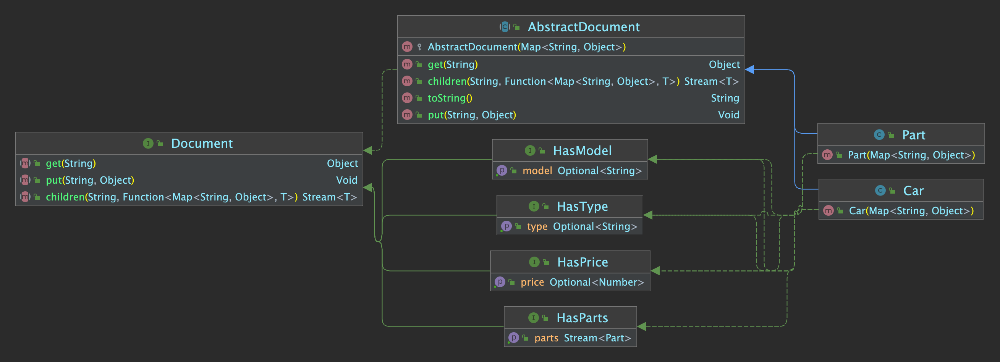

# Abstract-Document

## 의도

---

타입 세이프를 유지하면서 동적 속성을 사용하고 타입이 정해지지 않은 언어의 유연성을 확보하기 위함

## 설명

---

Abstract Document pattern은 추가, 동적인 속성들을 다룰 수 있습니다. 이 패턴을 통해 유형 안전성을 활성화하고 다른 클래스의 속성을 인터페이스 세트로 분리가 가능해집니다.

Real World example

> Consider a car that consists of multiple parts. However we don't know if the specific car really has all the parts, or just some of them. Our cars are dynamic and extremely flexible.

In plain words

> Abstract Document pattern allows attaching properties to objects without them knowing about it.

Wikipedia says

> An object-oriented structural design pattern for organizing objects in loosely typed key-value stores and exposing the data using typed views. The purpose of the pattern is to achieve a high degree of flexibility between components in a strongly typed language where new properties can be added to the object-tree on the fly, without losing the support of type-safety. The pattern makes use of traits to separate different properties of a class into different interfaces.

## 프로그램 예시

---

먼저 <span style='background-color: #f1f8ff'> Document</span>와 <span style='background-color: #f1f8ff'>AbstractDocument</span> 베이스 클래스들을 정의하겠습니다.

```java
public interface Document{
    void put(String key, Object value);

    Object get(String key);

    <T> Stream<T> children(String key, Function<Map<String, Object>, T> constructor);
}

public abstract class AbstractDocument implements Document {

  private final Map<String, Object> properties;

  protected AbstractDocument(Map<String, Object> properties) {
    Objects.requireNonNull(properties, "properties map is required");
    this.properties = properties;
  }

  @Override
  public Void put(String key, Object value) {
    properties.put(key, value);
    return null;
  }

  @Override
  public Object get(String key) {
    return properties.get(key);
  }

  @Override
  public <T> Stream<T> children(String key, Function<Map<String, Object>, T> constructor) {
    return Stream.ofNullable(get(key))
        .filter(Objects::nonNull)
        .map(el -> (List<Map<String, Object>>) el)
        .findAny()
        .stream()
        .flatMap(Collection::stream)
        .map(constructor);
  }

}
```

다음으로 enum클래스의 Property를 정의하고 type,price,model,parts를 위한 인터페이스 집합을 정의하겠습니다.

```java
public enum Property {

  PARTS, TYPE, PRICE, MODEL
}

public interface HasType extends Document {

  default Optional<String> getType() {
    return Optional.ofNullable((String) get(Property.TYPE.toString()));
  }
}

public interface HasPrice extends Document {

  default Optional<Number> getPrice() {
    return Optional.ofNullable((Number) get(Property.PRICE.toString()));
  }
}
public interface HasModel extends Document {

  default Optional<String> getModel() {
    return Optional.ofNullable((String) get(Property.MODEL.toString()));
  }
}

public interface HasParts extends Document {

  default Stream<Part> getParts() {
    return children(Property.PARTS.toString(), Part::new);
  }
}
```

Now we are ready to introduce the Car.

```java
public class Car extends AbstractDocument implements HasModel, HasPrice, HasParts {

  public Car(Map<String, Object> properties) {
    super(properties);
  }
}
```

And finally here's how we construct and use the Car in a full example.

```java
    LOGGER.info("Constructing parts and car");

    var wheelProperties = Map.of(
        Property.TYPE.toString(), "wheel",
        Property.MODEL.toString(), "15C",
        Property.PRICE.toString(), 100L);

    var doorProperties = Map.of(
        Property.TYPE.toString(), "door",
        Property.MODEL.toString(), "Lambo",
        Property.PRICE.toString(), 300L);

    var carProperties = Map.of(
        Property.MODEL.toString(), "300SL",
        Property.PRICE.toString(), 10000L,
        Property.PARTS.toString(), List.of(wheelProperties, doorProperties));

    var car = new Car(carProperties);

    LOGGER.info("Here is our car:");
    LOGGER.info("-> model: {}", car.getModel().orElseThrow());
    LOGGER.info("-> price: {}", car.getPrice().orElseThrow());
    LOGGER.info("-> parts: ");
    car.getParts().forEach(p -> LOGGER.info("\t{}/{}/{}",
        p.getType().orElse(null),
        p.getModel().orElse(null),
        p.getPrice().orElse(null))
    );

    // Constructing parts and car
    // Here is our car:
    // model: 300SL
    // price: 10000
    // parts:
    // wheel/15C/100
    // door/Lambo/300
```

## Class diagram

---



## Applicability

---

Abstract Document Pattern을 다음과 같은 케이스에서 사용하시면 좋습니다.

- 새로운 속성을 즉시 추가할 필요가 있는 상황
- 도메인을 트리와 같은 구조로 유연하게 구성할 수 있는 방법을 원할 때
- 좀 더 느슨하게 결합된 시스템을 원하는 경우

## 코드 링크

---


